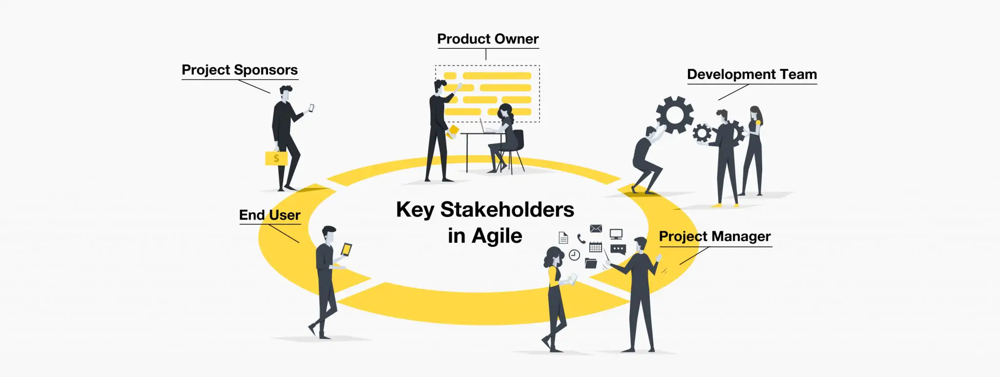
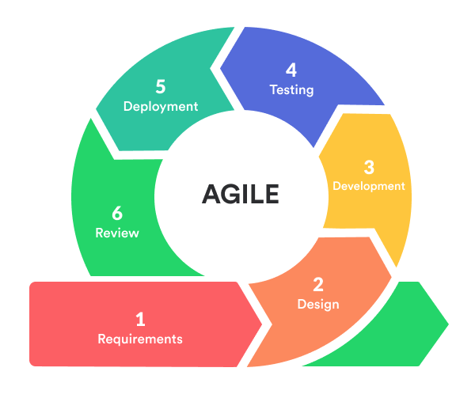

# Software Development Project 1

Welcome to the Software Development Project 1 course!

---

# Agile software development and Scrum

- The learning objectives for this week are:
  - Knowing about the course contents, assessment and schedule
  - Knowing what is agile software development
  - Knowing what is the software development lifecycle
  - Knowing what is Scrum
  - Knowing how requirements are managed in agile software development

---

# About the course

- So far during the studies we have mostly worked on fairly small applications by ourselfs
- Different kind of problems arise while we work on more complicated applications in a software development team
- These problems aren't only technical, the management of the software development process can be quite tricky
- During this course, we will learn how to manage the software development process and how to work as a member of a software development team
- We will learn these skills in practice by developing a software development project in a software development team consisting of 4-5 students

---

# About the course

- Each team will be developing a quiz management application described in more in detail on the course page
- The final application will be a full stack web application application in which a frontend communicates with a backend
- The implementation technologies of the application are Spring Boot and React
- The development of the project is split into three two-week iterations called Sprints
- Each Sprint has high-level requirements, but teams should make most of the technical decisions themselves
- The project starts on week three

---

# Assessment

- The assessment is based on the _team's project_ and the _personal contributions_ of a team member
- The project assessment is based on the following aspects:
  - Technical implementation
  - Project management
  - Documentation
  - Following the schedule
- Each of the three Sprints is assessed based on the Sprint requirements
- The team can earn up to 40 points from the project (15 + 15 + 10 points)

---

# Assessment

- Each team member's personal assessment is based on the following aspects:
  - Activity in team work
  - Technical contributions
  - Project management and documentation contributions
  - Exercise submissions
- The personal assessment is done based on the teacher's observations and peer reviews from the team members
- Each team member can earn up to 20 points based on their personal efforts towards the project

---

# Assessment

- The final grade (1-5) is composed of the project points (maximum of 40 points) and the personal points (maximum of 20 points)
- The following are necessary to pass the course:
  - At least 20 of the first two week's exercises have to be completed to pass the course
  - Written peer review for each team member
  - Passing grade from the peer reviews
  - Written final report

---

# Schedule

- There are weekly sessions during which we will cover different topics
- Attendance on weekly sessions is _mandatory_
- During the first two weeks, we will cover topics that are important to grasp before starting to work on the project
- During the team work we will learn about new topics, but most importantly we will learn how to apply our knowledge in practice
- Both individual exercises and project exercises have _deadlines_
- The detailed schedule can be found on the course page

---

# What makes a software development project?

- So far during the studies we have implemented software mostly alone with more or less detailed instructions on what to do
- In real world software is developed in _software development projects_ by a diverse group of people referred to as the _software development team_
- Depending of the budget and scope of the project, the timespan of a software development can be anything from a few months to many years

---

# Stakeholders

- A software development project affects many people in different ways
- For example, the software's end users get to use features they desire and the customer gets financial value for the project they are funding
- The people or groups of people affected by a software development project are referred to as the software development project's _stakeholders_

---

# Stakeholders

- On top of technical skills, the future of software developer's work will mostly likely consist more and more on understanding the needs of the stakeholders and applying technical solutions to meet those needs

  > "If you go forward 24 months from now, or some amount of time -- I can't exactly predict where it is -- it's possible that most developers are not coding. It just means that each of us has to get more in tune with what our customers need and what the actual end thing is that we're going to try to go build because that's going to be more and more of what the work is as opposed to sitting down and actually writing code"
  >
  > -- Matt Garman, CEO of Amazon Web Services (AWS) in 2024

---

# Software development team

- A software development team is responsible for the outcome of the project
- It is a diverse and self-organized group of people consisting of not only technical people
- The team can consist for example a representive of the end users (commonly referred to as a product owner), user-experience (UI) and user-interface (UX) designers and sofware developers
- The size of team varies, but they commonly consist of fewer than 10 people
- So that a software development team can work together efficiently they need to follow a _common process_ in their day-to-day work
- This process is referred to as a _software development process_

---

# Problems with software development projects

- Developing a software based on the stakeholders needs in a software development team isn't simple and many things can (and often does) go wrong
- Which problems do you think software development projects commonly have? Are the problems technical such as programming errors or something else?
- First discuss, then share your thoughts on the _three of the most common problems_

---

# Problems with software development projects

- Based on a [study conducted in 2022](https://idego-group.com/blog/2022/02/17/problems-in-software-development-developers-survey-results-blog/), _70% of software development problems are non-technical_. The three most common problems raised were:
  - Bad management
  - Bad communication
  - Customer-related issues
- These are among the problems that the software development process should tackle

---

# Agile software development

> _"able to move quickly and easily"_
>
> ⎯ Dictionary definition for the word _"agile"_

- The word _agile_ is often used in many industries to describe the way of working in organizations
- The word is commonly used in a positive manner, for example, "we are an _agile_ organization", or "we work in a _agile_ manner"
- In _agile software development_, the development process follows values and principles that have been found to lead to successful software development projects
- These values and principles have been constituted and written down as the _Manifesto for Agile Software Development_ by famous software development pioneers

---

# Manifesto for Agile Software Development

- The Manifesto for Agile Software Development describes the following values:
  - Individuals and interactions over processes and tools
  - Working software over comprehensive documentation
  - Customer collaboration over contract negotiation
  - Responding to change over following a plan

---

# Agile software development

- One of the key value is the attitude towards _change_
- For example, there is often need to change the software's requirements during the development process
- Agile software development process should welcome any kind of change with open arms
- That is, because change is inevitable and frequent in many business environments
- The Manifesto for Agile Software Development doesn't go into details on how to actually implement these values in practice
- Different Agile software development process frameworks, such as _Scrum_ and _SAFe_ describe a detailed process that follows these values

---

# Software development lifecycle

- It requires _different phases_ to be completed so that an idea of what we can do with a software becomes an actual working software which provides the desired features
- The software development process is divided into different phases:
  1. Requirements phase
  2. Design phase
  3. Implementation phase
  4. Test phase
  5. Deployment phase
  6. Maintenance phase
- The phases are commonly performed in the mentioned order and the whole process is often called the _software development lifecycle_

---

# Requirements phase

- In the _requirements phase_, the development team collects requirements from several stakeholders such as customers and end users
- The requirements cover use cases that describe user interactions that the software must provide
- For example, "As a blog reader I want to browse list of blog posts of a blog so that I can find interesting posts to read" could be a requirement for a blog application
- These requirements are commonly documented and managed in so called "backlogs" which act as a prioritized list of work for the development team

---

# Design phase

- In the _design phase_, the development team analyzes requirements and identifies the best solutions to create the software
- For example, they may consider integrating pre-existing modules, making technology choices, and identifying development tools
- During the design phase different kind of documentation, such as architecture diagrams, are produced to support the _implementation phase_

---

# Implementation phase

- In the _implementation phase_, the development team codes the product
- They analyze the requirements to identify smaller coding tasks they can do daily to achieve the final result
- The organization of the collaboration during the implementation phase requires the development team to carefully follow mutually agreed _process_
- The development team needs to use different kind of tools to ease the collaboration, such as _version control tools_, which we will cover later

---

# Test phase

- In the _test phase_, the development team combines automation and manual testing to check that the software works as intended
- In practice, the test phase isn't usually separated from the implementation phase
- This means that software developers usually implement a small coding task, write automated test cases for the task and moves on to the next task
- This practice is even taken so far that the tests are written _before_ the implementation which is referred to as test-driven development (TDD)

---

# Deployment and maintenance phase

- In the _deployment phase_, the implemented software is distributed to the users
- For example, a web application is published online so that users can access it with their browsers
- Once the software is distributed, it needs to be constantly _maintained_
- In the _maintenance phase_, among other tasks, the development team fixes bugs, resolves user issues, and manages software changes

---

# Agile software development lifecycle

- Agile software development has an _iterative approach_ in the software development lifecycle
- In this approach, the software is developed in short, typically one or two-week-long iterations
- Each iteration starts with the requirements phase and during the iteration design, implementation, test, deployment, and maintenance phases are completed
- The outcome of each iteration is working software that users can actually use and give feedback
- This cycle repeats in every iteration

---

# Benefits of the iterative approach

- The benefits of the iterative approach is the ability to respond to change quickly and the feedback loop it provides
- After each iteration the requirements can change which makes it easy to respond to new user and business needs
- After each iteration the users of the software can get their hands on new features which they can give feedback on
- The feedback can be used to define requirements for the next iterations
- This forms the feedback loop which is the heartbeat of the agile software development process

---

# Scrum

- _Scrum_ is an widely adopted iterative software development process framework that defines practical ways to carry out agile software development principles
- Based on the State of Agile report of year 2022, 87% of respondents used Scrum at the team level
- In the Scrum process, the _Scrum Team_ developes software in fixed length iterations called _Sprints_
- Sprints should be kept short, preferably at most four weeks long
- In each Sprint, there are fixed _events_, which help the Scrum Team to organize their work and keep track on the progress of the Sprint
- During the course we will use Scrum to manage our software development process while working on the project

---

# Scrum Team

- The _Scrum Team_ is responsible for the outcome of each Sprint
- It consists of one _Scrum Master_, one _Product Owner_, and _Developers_
- To avoid coordination difficulties, the size of the Scrum Team should be fairly small, preferably at most 10 people
- _Developers_ are responsible for the technical implementation of the software
- _Product Owner_ is responsible for maximizing the value of the product resulting from the work of the Scrum Team
- _Scrum Master_ is responsible that the software development process follows the Scrum practices
- During the course, the teacher is the Product Owner and students are the Developers

---

# Scrum Events

- Four _events_ take place during each Sprint: _Sprint planning_, _Daily Scrum_, _Sprint Review_ and _Retrospective_
- At the beginning of the Sprint, there's a _Sprint planning_ event during which the Scrum Team decides which set of requirements are implement during the upcoming Sprint
- During the Sprint, the Scrum Teams organizes _Daily Scrum_ meetings to discuss the progress of the Sprint
- At end of the Sprint, there's a _Sprint Review_ event during which the Scrum Team goes through the outcome of the Sprint
- Before starting the next Sprint, the Scrum Team discuss the problems with the process and figure out ways to improve it during the _Retrospective_ event

---

# The Scrum process

---

# Agile requirement specification

- During the requirements phase, the stakeholders' requirements for the software are defined and documented
- To derive the requirements, the development team needs to have a clear and thorough understanding of the software under development and continuously communicate with the stakeholders
- In agile software development, requirements are commonly written as _user stories_
- A user story is a short, simple description of a feature told from the perspective of the person who desires the new feature in the software
- During each Sprint, the Developers of the Scrum Team implement features for the software based on user stories
- User stories are sort of todo items, which help the Scrum Team to understand and remember what kind of features need to be implemented for the software

---

# User story

- For example, two separate user stories for a blog application could be the following:
  - "As a content creator, I want to create a new blog so that I can start writing blog posts"
  - "As a blog reader, I want to browse list of blog posts of a blog so that I can find interesting posts to read"
- A user story is written from the user's perspective and commonly follows the following format:

  > As [a user persona], I want [to perform this action] so that [I can accomplish this goal].

---

# Writing good user stories

- A good user story describes a _feature that provides value for the end user of the software_
- This means, that the description should be written so that the _customer can understand it_
- For example the following user story is too technical:

  > ❌ As a developer, I want to optimize the database by adding a new index to the blog posts table so that the list of blog posts of a blog loads fast.

- A better user story would express the feature from the user's point of view:

  > ✅ As a blog reader, I want the list of blog posts of a blog load fast so that I can find interesting blog posts to read quickly.

---

# The INVEST criteria

- The _INVEST criteria_ is one popular guideline for a good user story
- _Independent_: written so they can be developed and tested independently of other stories
- _Negotiable_: written to allow for negotiation between the development team and the customer
- _Valuable_: should provide value to the end user.
- _Estimable_: written in a way that allows the development team to estimate the amount of effort required to complete them
- _Small_: small enough to be completed within a single iteration of the development process
- _Testable_: written to allow testing to be performed at the end of the development process

---

# The INVEST criteria

- Which INVEST criteria does the following user story violate?

  > ❌ As a content creator, I want to register with a username and password, a profile picture, and a profile description so that I can start writing blog posts

---

# The INVEST criteria

- It is better to split these kinds of big user stories into multiple smaller user stories:

  > ✅ As a content creator, I want to register with a username and password so that I can start writing blog posts

  > ✅ As a content creator, I want to register with a profile picture so that my readers know what I look like

  > ✅ As a content creator, I want to register with a profile description so that my readers know about me

- If the description of the feature contains words like "and" or "or", it could be that the user story can be split into smaller user stories
