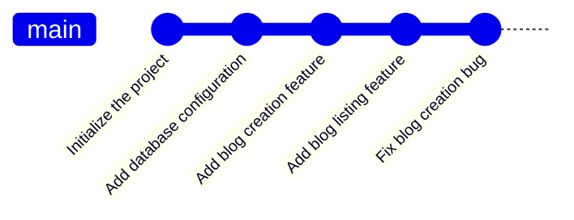

## Version control processes in software development

- The learning objectives for this week are:
  - Knowing the purpose of version control in the software development workflow
  - Knowing the purpose of GitHub and its relationship with the Git version control tool
  - Knowing how to create a Git project, use the most common Git commands, and publish a Git project on GitHub
  - Knowing how to use Git and GitHub in collaboration with a team

---

## Version control

- When we are working on software in a software development team, we need to be able to **share our code** and **keep track of the changes in our code**
- **Version control** refers to a service used for storing code
- There are two primary reasons for using it:
  - It allows us to **store backups** of both the current and older versions of the software
  - It allows us to **share software-related code** with other developers, which makes collaboration easy
- In practice, **every** software development project uses version control to manage the collaborative development of the project's code
- This makes it, on top of programming, the most important skill of a software developer

---

## Features of version control tools



- Version control tools allow **marking a specific state of a project** so that one can return to it later by wrapping changes into a **commit** with a message describing the changes
- If (or when) something goes wrong in the development of new features, we can easily return to an older and functional version of the project
- Version control stores all the marked states creating a **commit log**, so any team member can follow the changes in the code, like who has done what and when
- This also makes it **easier to find bugs, or errors in the system**, because we can inspect changes introduced by individual commits

---

## Version control tools

```bash
git commit -m "Add blog listing feature"
```

- There are several different version control tools that offer the mentioned functionality
- **Git** is among the most popular version control tools and it is used heavily in modern software development
- Knowing the basics of Git is commonly **considered a must-have skill** for being able to work as a member of a software development team
- Git has **graphical** (e.g. in Visual Studio Code) and **command-line** interfaces
- The command-line interface might seem difficult to use at first, but being able to use a command-line interface is a very valuable skill in the industry
- During the course we will learn how to use the command-line interface and some Visual Studio Code integrations

---

## GitHub 

- Git provides the version control functionality, but it doesn't provide us with a way to **store** or **publish** projects outside our own computer
- For this, there are several different platforms, such as **GitLab**, **Bitbucket** and **GitHub**
- The basic idea for these platforms is the same: they allow us to store and publish project-related code into a single **centralized code base** which all team members contribute to
- These platforms also provide their own services around Git, e.g. bug and feature requirement tracking and code review functionalities
- During this course we will be using the **GitHub** platform to store and publish our project's code and some other services provided by GitHub, e.g. managing feature requirements in the GitHub Projects platform

---

## Using GitHub to showcase your skills

- The software developer's GitHub account is commonly their **personal portfolio**, meaning all their projects are there for others to see
- When applying for a job, having a GitHub account with a representative profile and projects is very beneficial because it is the easiest way to showcase your work
- Besides the project's code, it is also important to **clearly communicate the project's purpose and implementation details** so that others can understand it more easily
- That is why during the course, we also learn ways to document different aspects of our projects and how documentation is stored and evolves side by side with our code in GitHub
